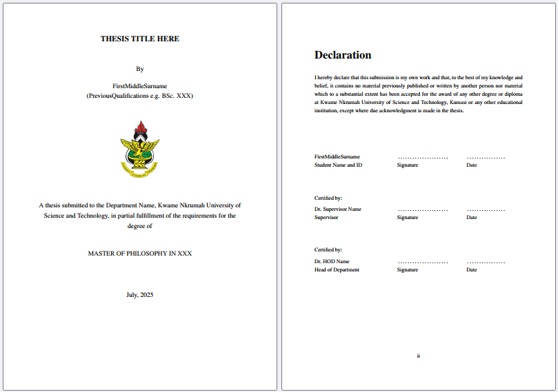

# KNUST Postgraduate Thesis LaTeX Template

<center>

</center>

A comprehensive LaTeX template for MPhil and PhD theses following KNUST's formatting guidelines, as described in [GUIDE FOR PREPARATION AND EVALUATION OF GRADUATE THESIS](https://idl.knust.edu.gh/sites/idl.knust.edu.gh/files/2022-01/GUIDE%20FOR%20PREPARATION%20AND%20EVALUATION%20OF%20GRADUATE%20THESIS.pdf). 

This template is designed to be clean, reusable, and easily customizable for different thesis requirements.

Give this Repo a Star ⭐

## Features

✅ **Full Format Compliance**
- A4 paper size (21.0 x 29.7 cm)
- Times New Roman 12pt font throughout
- Proper margins: 2.5cm outer, 4cm gutter
- 1.5 line spacing for main text, single spacing for special sections
- Roman numerals for front matter (starting from ii)
- Arabic numerals for main body and back matter
- Proper caption placement (tables above, figures below)
- Chapter-linked numbering for figures and tables

✅ **Professional Structure**
- Modular file organization for easy maintenance
- Separate files for each chapter and section
- Automatic table of contents, figures, and tables
- Multiple citation styles (Harvard, IEEE, APA) - easily switchable
- PDF bookmarks/outline for easy navigation
- Organized images folder structure


## Quick Start

### 1. Download the Template

Clone this repository or download as ZIP:

```bash
git clone https://github.com/nyakotey/thesix.git
cd thesis-latex-template
```

### 2. Customize Your Information

Edit the thesis information in `main.tex`. These include:

```latex
\newcommand{\thesistitle}{Your Thesis Title Here}
\newcommand{\thesisauthor}{Your Full Name}
\newcommand{\thesisdegree}{Master of Philosopy in XXX} % or Doctor of Philosophy
\newcommand{\thesisdepartment}{Your Department}
\newcommand{\thesissupervisor}{Dr. Supervisor Name}
```

### 3. Add Your Content

Replace the placeholder content in:
- `frontmatter/` - Abstract, acknowledgments, etc.
- `chapters/` - Your research chapters
- `backmatter/` - References and appendices
- `references.bib` - Your bibliography entries
- `images/` - All your figures and images (PDF, PNG, JPG formats)

### 4. Compile

Use your preferred LaTeX editor, vscode with Latex workshop extension or command line:

```bash
pdflatex main.tex
bibtex main
pdflatex main.tex
pdflatex main.tex
```

The resultant output is `main.pdf`. Run the above command to view the template's version.


> [!NOTE]
>
> Since the introduction of the KNUST Thesis Deposition Management System (TDMS), hardbound copies may no longer be required by your department. The settings may no longer be necessary. Use 2.5cm or 4cm gutter as you please.


> [!NOTE]
>
> Current page settings are for soft-copy viewing only! If you intend to produce a hardbound printout, use the print settings, which are optimized for book binding. Read the [FAQs](#faqs-and-open-issues)


## File Structure

```
thesis-template/
├── main.tex                 # Main document file
├── references.bib           # Bibliography database
├── images/                  # All figures and images
├── frontmatter/
│   ├── title.tex           # Title page
│   ├── declaration.tex     # Declaration of originality
│   ├── dedication.tex      # Dedication (optional)
│   ├── acknowledgments.tex # Acknowledgments
│   ├── abstract.tex        # Abstract
│   ├── table_of_contents.tex
│   ├── list_of_figures.tex
│   ├── list_of_tables.tex
│   └── list_of_abbreviations.tex
├── chapters/
│   ├── chapter1.tex        # Introduction
│   ├── chapter2.tex        # Literature Review
│   ├── chapter3.tex        # Methodology
│   ├── chapter4.tex        # Results and Analysis
│   ├── chapter5.tex        # Discussion
│   └── chapter6.tex        # Conclusion
└── backmatter/
    ├── bibliography.tex    # References formatting
    └── appendices.tex      # Appendices
```

## Customization

### Adding/Removing Chapters

To add a new chapter:
1. Create `chapters/chapter7.tex`
2. Add `\input{chapters/chapter7}` to `main.tex`

To remove a chapter:
1. Delete the file from `chapters/`
2. Remove the `\input` line from `main.tex`

### Figures and Tables

**Figures** (captions below):
```latex
\begin{figure}[htbp]
\centering
\includegraphics[width=0.8\textwidth]{images/your_figure.pdf}
\singlespace
\caption{Your figure caption here.}
\label{fig:yourlabel}
\endsinglespace
\end{figure}
```

**Tables** (captions above):
```latex
\begin{table}[htbp]
\singlespace
\caption{Your table caption}
\endsinglespace
\renewcommand{\arraystretch}{1.5}
\label{tab:yourlabel}
\centering
\begin{tabular}{lcc}
\toprule
Header 1 & Header 2 & Header 3 \\
\midrule
Data 1 & Data 2 & Data 3 \\
\bottomrule
\end{tabular}
\end{table}
```

### Citations
Harvard bibliography style is default, as in thesis guide. <br>
IEEE and APA were added for special cases.

**Citation commands**:
```latex
\citet{AuthorYear}                    % Adarkwa (2011) argues that...
\citep{AuthorYear}                    % According to (Cobbinah et al., 2015)...
\cite{AuthorYear}                     % Basic citation format
\citep{Author1, Author2}              % Multiple citations (Author1, 2015; Author2, 2020)
```


## Tips for Success

1. **Start Early**: Set up the template structure before you start writing
2. **Regular Backups**: Use Git or cloud storage for version control
3. **Reference Manager**: Use Zotero, Mendeley, or EndNote to manage references
4. **Regular Compilation**: Compile frequently to catch errors early

## Word Count

For MPhil theses, the limit is 60,000 words inclusive of footnotes and appendices (excluding documentary/statistical appendices and bibliography).

To count words in your LaTeX document:
```bash
texcount main.tex
```

## Overleaf Compatibility

This template is fully compatible with online latex editors such as Overleaf. Simply:
1. Create a new project on Overleaf
2. Upload all template files
3. Run Compile

## Contributing

Contributions are welcome! Please:
1. Fork the repository
2. Create a feature branch
3. Make your improvements
4. Submit a pull request


## FAQs and Open Issues

### Why does the print version have a couple of blank pages and large margins?

> The thesis submitted to the Board of Graduate School should normally be double-sided. The margins are to be: 2.5 cm with the gutter margin, 4 cm.

The hardbound copy of the thesis is intended for double-sided printing (text on both front and back pages). Per latex recommended typesetting, new chapters begin on a right-hand (recto) page. Therefore, blank pages are sometimes inserted when the preceding chapter ends on a right-hand page, ensuring the next chapter starts correctly. The large gutter margin provides sufficient space for binding, preventing text from being obscured by the spine.
If you'd rather not have blank pages or recto behaviour, you can always customize the latex settings. This is a starter template after all.

### Why are there two blank pages with the same page number before the appendix?

This edge case can occur when the references section ends on a right-hand page and the appendix content follows. In such cases, LaTeX inserts an extra blank page to maintain the correct layout, sometimes resulting in a duplicate page number due to conflict with automatic appendix numbering hack.

**Current workaround:** Manually delete the duplicate blank page in the final PDF before printing. Community contributions to improve this behavior are welcome—feel free to submit a pull request!


## License

This template is released under the MIT License. Feel free to use, modify, and distribute.

## Support

If you encounter issues or have suggestions:
- Open an issue on GitHub
- Check the [LaTeX documentation](https://www.latex-project.org/help/documentation/)

---

**Good luck with your thesis! 🎓**
